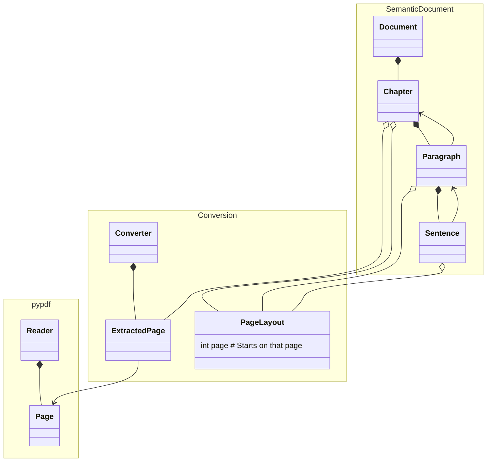

# Convert Pdf to Markdown python package<!-- omit from toc -->

## Table of contents<!-- omit from toc -->

- [Model class diagram](#model-class-diagram)
- [References How to recover document structure and plain text from PDF?](#references-how-to-recover-document-structure-and-plain-text-from-pdf)
- [References Converting PDF to markdown techniques](#references-converting-pdf-to-markdown-techniques)

## Model class diagram

## References How to recover document structure and plain text from PDF?

- Reddit post on [How to recover document structure and plain text from PDF?](https://www.reddit.com/r/LocalLLaMA/comments/1am3fz8/how_to_recover_document_structure_and_plain_text) with a focus on RAG applications.
- PDFMiner.six [explanations of how difficult extracting text from pdf can be](https://pdfminersix.readthedocs.io/en/latest/topic/converting_pdf_to_text.html)

## References Converting PDF to markdown techniques

https://medium.com/data-science-collective/convert-pdfs-to-markdown-using-local-llms-c5232f3b50fc