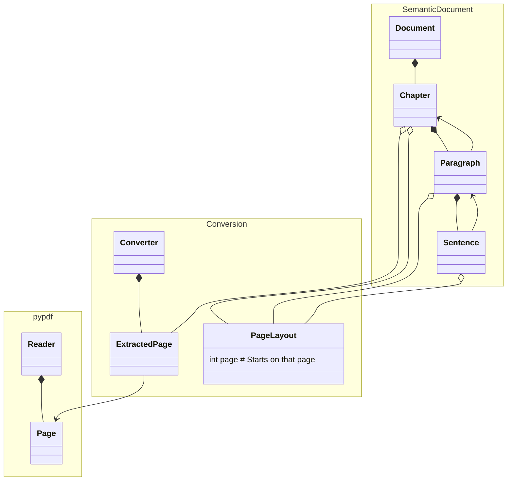

# Convert Pdf to Markdown python package<!-- omit from toc -->

## Table of contents<!-- omit from toc -->

- [Installation](#installation)
- [Converting a new pdf: what needs to be done](#converting-a-new-pdf-what-needs-to-be-done)
- [Model class diagram](#model-class-diagram)
- [References How to recover document structure and plain text from PDF?](#references-how-to-recover-document-structure-and-plain-text-from-pdf)
- [References Converting PDF to markdown techniques](#references-converting-pdf-to-markdown-techniques)
- [Historical notes](#historical-notes)

## Installation

```bash
pip install git+https://github.com:EricBoix/jejuneness.git/Data/ConvertPdfToMarkdown
```

## Converting a new pdf: what needs to be done

A lot tedious has to be in order to retrieve the [python re (regular expressions)](https://docs.python.org/3/library/re.html) patterns that allow the retrieval of structural elements (chapters, sub-chapters, figures) of the PDF document. In order to so, you can

- print the raw version of the pdf to text reader. In order to do so, refer to [`ConvertPdfToMarkdown/print_document_raw_pages()`](./Traces.py) python helper and place the raw print e.g. in some `RAW.txt` file.
- Manually explore `RAW.txt` with you favorite editor to explore and extract what you consider might be representative raw examples. If you are using `vim`, look at some search patterns provided by [this `Readme.md`](../ISBN_978-1-5011-5698-4_-_The_Mind_Illuminated/Convert/SelfMadePython/Readme.md#helpers-to-infer-pattern-rules-to-recognizeextract-a-chapter-sub-chapter-figures)
- Then try to infer patterns with the help of online regular expression interpreters e.g. [`regex101`](https://regex101.com/) (don't forget to select the Python language on the right hand side list of available languages)
- Only then transpose those patters to `ConvertPdfToMarkdown/Splitter`

## Model class diagram



## References How to recover document structure and plain text from PDF?

- Reddit post on [How to recover document structure and plain text from PDF?](https://www.reddit.com/r/LocalLLaMA/comments/1am3fz8/how_to_recover_document_structure_and_plain_text) with a focus on RAG applications.
- PDFMiner.six's [explanations of how difficult extracting text from pdf can be](https://pdfminersix.readthedocs.io/en/latest/topic/converting_pdf_to_text.html)

## References Converting PDF to markdown techniques

https://medium.com/data-science-collective/convert-pdfs-to-markdown-using-local-llms-c5232f3b50fc

## Historical notes

### Extracting special regexp patterns

When development stage was centered on pages (as opposed to paragraphs), there was a need for removing the  newline characters ("\n") but only when they were preceded or followed either by a single whitespace or some character (examples "here\nand", "here \nand", "here\n and"). Because finding the proper regex to do so was not trivial (your milage may vary), the following keeps track of the sub() call, in case it is needed later on. The regexp logic is that we need to use both lookbehind and lookahead notations and can be understood as: look for a newline preceded (?<=...)  by any character that is not an extended whitespace (\s) and followed (?=[^\s]) by any character that is not a whitespace:
 ```result_text = re.sub("(?<=[^\s])\n(?=[^\s])", " ", input_text)```
