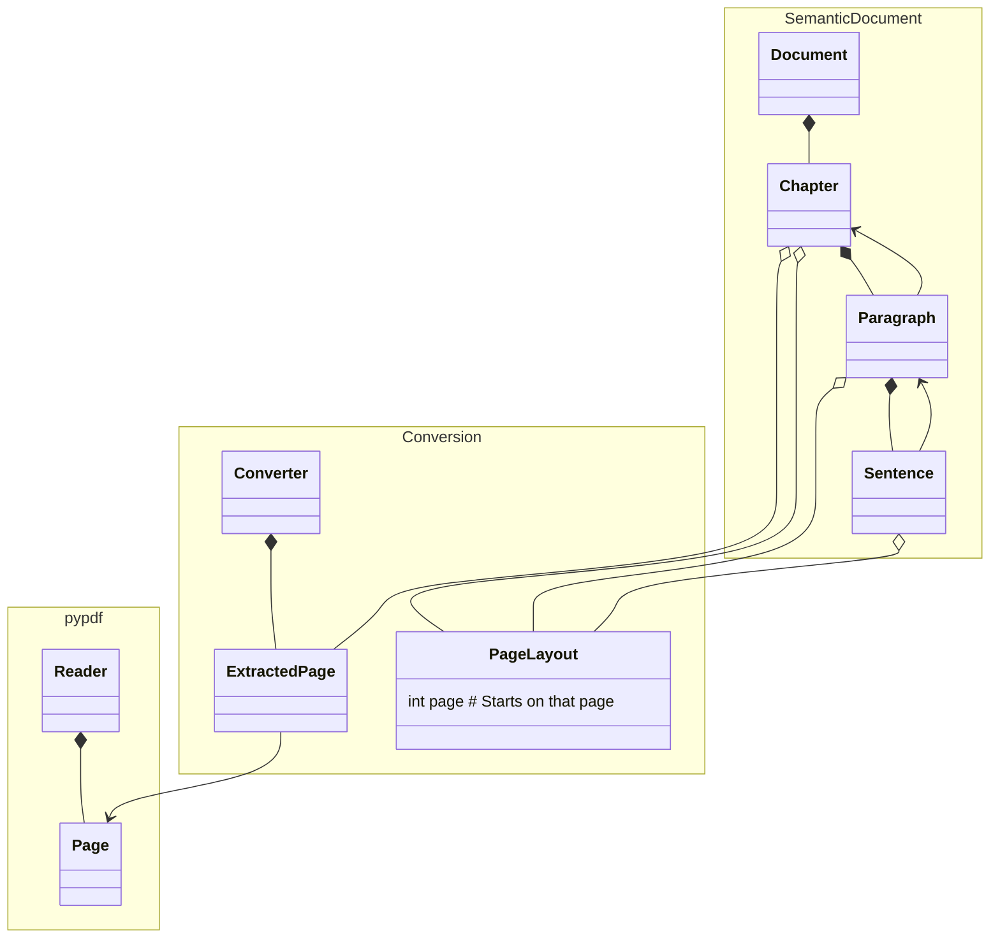

# Data Directory<!-- omit from toc -->

## Table of contents<!-- omit from toc -->

- [Setup](#setup)
- [Running tests](#running-tests)
- [Model class diagram](#model-class-diagram)
- [References](#references)

## Setup

```bash
cd `git rev-parse --show-toplevel`/Data
make setup
```

Or manually:

```bash
python3.10 -m venv venv
source ./venv/bin/activate
pip install -r requirements.txt
pip install git+https://github.com/EricBoix/pdf-to-markdown.git
```

## Running tests

With the help of `make`

```bash
cd `git rev-parse --show-toplevel`/Data
make test              # Run tests (assumes venv exists)
make clean-test        # Clean slate: remove venv, recreate, run tests
```

Or manually:

```bash
cd `git rev-parse --show-toplevel`/Data
# To avoid cache possible nasty side-effects
deactivate && \rm -fr venv __pycache__/ 
python3.10 -m venv venv
source ./venv/bin/activate
pytest                       # all tests
pytest -v                    # verbose
pytest  --collect-only -q    # List individual tests
pytest -k ISBN_978-0-9835844 # Run a specific test (with a pattern selection)
```

## Model class diagram



## References

### Recovering document structure from PDF

- Reddit post on [How to recover document structure and plain text from PDF?](https://www.reddit.com/r/LocalLLaMA/comments/1am3fz8/how_to_recover_document_structure_and_plain_text) with a focus on RAG applications.
- PDFMiner.six [explanations of how difficult extracting text from pdf can be](https://pdfminersix.readthedocs.io/en/latest/topic/converting_pdf_to_text.html)

### Converting PDF to markdown

<https://medium.com/data-science-collective/convert-pdfs-to-markdown-using-local-llms-c5232f3b50fc>
