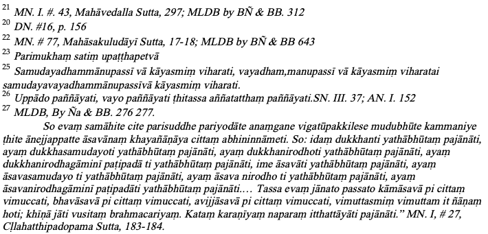
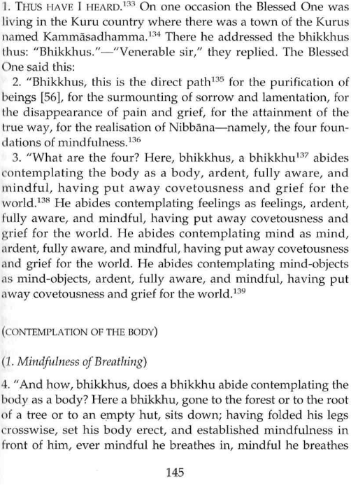
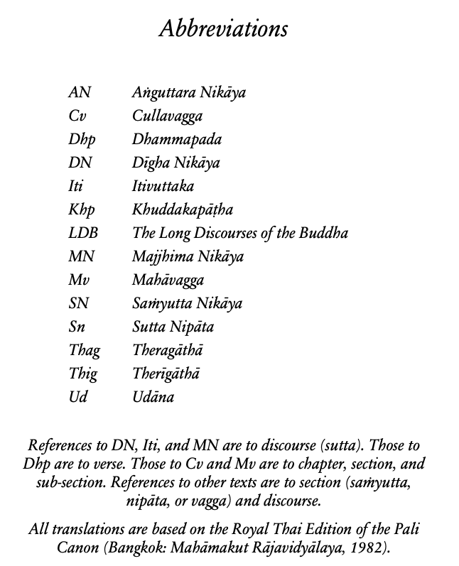
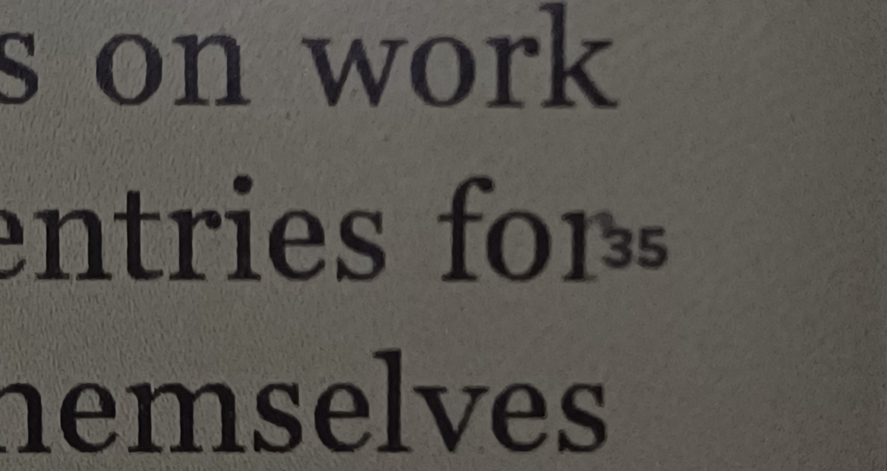

# Needs for citations and references<!-- omit in toc -->

## Table of content<!-- omit in toc -->

- [Citation examples encountered in Buddhist litterature](#citation-examples-encountered-in-buddhist-litterature)
  - [Classic abbreviations](#classic-abbreviations)
    - [A somewhat arbitrary division](#a-somewhat-arbitrary-division)
    - [WARNING: Sutta Number differs from PTS references](#warning-sutta-number-differs-from-pts-references)
  - [Pali canon book abbreviations](#pali-canon-book-abbreviations)
  - [Sentence/Paragraph number as margin annotation](#sentenceparagraph-number-as-margin-annotation)
  - [Concerning page numbering](#concerning-page-numbering)
- [The (almost) final need: division references at the sentence level](#the-almost-final-need-division-references-at-the-sentence-level)
- [Tool testing](#tool-testing)
- [References](#references)

## Citation examples encountered in Buddhist litterature

### Classic abbreviations

If we look at Henepola Gunaratana's footnotes, in his article "Should we come out of Jhana", they typically look like the following picture
.
(Majjhima Nikaya)

#### A somewhat arbitrary division

The second part of footnote `21` (refer above), which goes `MLDB by BÑ && BB. 312` stands for `The `[`Middle Length Discourses of the Buddha`](https://en.wikipedia.org/wiki/Majjhima_Nik%C4%81ya) `translated by Bhikkhu Nanamoli and Bhikkhu Bodhi` and `312` is the number of some arbitrary division (made by the authors?) as sets of sentences (not a paragraph and bigger than a single sentence) as encountered in the paper edition.

The following picture depicts the layout of the [first three numbers](https://zcla.org/wp-content/uploads/MembersArea/Documents/MN10.pdf)


Such divisions are quite similar to the ones used for [bible citation](https://en.wikipedia.org/wiki/Bible_citation) for which bit more precise reference is only possible because the original text publishers offer (diverse) multi-level referenceable divisions like [chapters](https://en.wikipedia.org/wiki/Chapters_and_verses_of_the_Bible#Chapters), section, paragraphs, [verses](https://en.wikipedia.org/wiki/Chapters_and_verses_of_the_Bible#Verses) and phrases.
Alas verse divisions are quite arbitrary (and thus not unique) and we should prefer a standardized multi-level division system.
Although as the one proposing such division (and in order to avoid any ambiguity or even mistake due to some failing division algorithm) we should provide the divided version of the original texts.
As `dividers` we should provide the texts with the inclusion/integration within those texts of the build/computed division/references (in a fashion similar to the one used by [Robert Etienne](https://en.wikipedia.org/wiki/Chapters_and_verses_of_the_Bible) we he introduced is verse numbering).

#### WARNING: Sutta Number differs from PTS references

A reference to a sutta, based on volume and page, for [Pali Text Society (PTS)](https://en.wikipedia.org/wiki/Pali_Text_Society) (e.g. DN 1: Brahmajāla) is not the same as a reference based on number or name in sutta numbering.

They are [Sutta Number to PTS Vol & Pg converters](https://palistudies.blogspot.com/2020/02/sutta-number-to-pts-reference-converter.html?m=1#more)

### Pali canon book abbreviations

Here is a commonly encountered abbreviation system for referring to the [Pali canon](https://en.wikipedia.org/wiki/Pali_Canon)


### Sentence/Paragraph number as margin annotation

Eventually the following picture illustrates how to display a sentence number as an annotation in the margin of some text


### Concerning page numbering

A `division reference` should be intrinsic to the document content (the text) as opposed to extrinsic that is referring to a particular layout or printing format (that depends the chosen layout that in turns depends on the paper size and the font).
The intrinsic property of a `division reference` prevents the usage of page numbering.
Nevertheless, when the original document (E-books in pdf or an [OCRized](https://en.wikipedia.org/wiki/Optical_character_recognition) version of a paper form) did provide some page numbering a division reference might chose to provide a page number as long as the exact source document is cited (provide an ISBN or a specific edition number).

Note that for some E-books, that are distributed in pdf, do not provide page numbering.
Still, because pdf can be seen as a set of pages (look for `pages tree` in pdf document), when interpreted a pdf document will emit pages (which does not imply that the document rendered with a pdf viewer will display page numbers). When possible such "renderer page number" might be used to decorate the `division reference` and the pdf should be provided.

Also note that the pdf rendering of scanned/ocr-ized paper books (or of an electronic version of a book that is also distributed in paper form) is (usually) page based and on many such pages a number is displayed (the numbering is here part of the content of the document). Sometimes such numbering does not start at page one, but might have prologues (or introductory notes) that have a roman numbering before starting a new digit based page numbering at the end of that section (in which case you might have a page `iii` and later on a page `3`). Besides such page numberings are usually different from the pdf page numbers (that is the page number obtained once the pdf layout is rendered by some viewer). For example the cover of a book (for the printed copy or when rendered with a pdf viewer) does not show any page number. Yet the pdf viewer does show a page number (not in the text section but in the layout section of the pdf viewer).
In which case a `division reference` that is decorated with a page number should use the content page number (that is the page number that is included in the content of the document and shown in the paper copy).

## The (almost) final need: division references at the sentence level

Assume we have a text document (or work) that we wish to annotate with references to external documents. Later on we will use a document browser that proposes some visual clues about the existing annotations and offers some technical means to access them. The classic illustrations are e.g. underlined URL links within html or tooltip popups (think of Wikipedia browsing).
Additionally, we wish such annotations to be at the sentence level (because, most often, this is the semantic atomic level).
In order to be able to refer to part of another document (work, book...textual document) and without quoting that document (that is copy the part of interest of the other document within the current document) we thus need a `sentence reference`.
A `sentence reference` is a concrete mean to designate a single sentence within a text document.

Note that short (or even long) quotations usually don't offer a sentence level reference but only a page reference (refer e.g. to the [OWL's in-text citation guide](https://owl.purdue.edu/owl/research_and_citation/apa_style/apa_formatting_and_style_guide/in_text_citations_the_basics.html), [Monash's citing and referencing](https://guides.lib.monash.edu/citing-referencing/vancouver-intext)) when [Harvard's referencing guide](https://libguides.scu.edu.au/harvard/citing-in-text) limit's itself to referencing the document as a whole.

A `division reference` could look like

```bash
chapter 3, sub-chapter I, paragraph 2, sentence 4
```

of `document reference` "author_A, author_B book titled book_title, ISBN".

If we adopt such division based referencing, we should not only provide the resulting divisions (and division references) but also the algorithms producing such divisions.
Because the logic of the divisions are directly expressed by the code.

## Tool testing

Refer to [citeproc-py test](../../ToolTesting/CiteProc/Readme.md) for what could be done with the `Bibtex + Markdown + Python` stack.

## References

- [Academic Markdown and Citations](https://v4.chriskrycho.com/2015/academic-markdown-and-citations.html) by Chris Krycho.