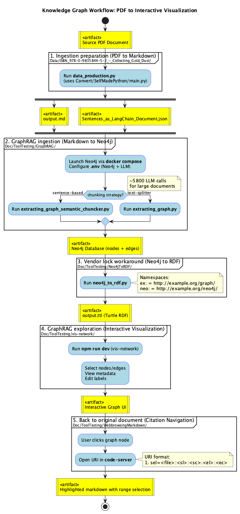

# jejuneness<!-- omit in toc -->

Don't let the [monkey](https://en.wikipedia.org/wiki/Monkey_mind) hinder you from sitting back on the [cushion](https://en.wikipedia.org/wiki/Zafu).

## Table of content<!-- omit in toc -->

- [Workflow Overview](#workflow-overview)
- [What's next](#whats-next)
  - [Knowledge graph visualisation](#knowledge-graph-visualisation)

## Workflow Overview

For details, see [Doc/Workflow/README.md](Doc/Workflow/README.md).

## What's next

### Knowledge graph visualisation

Just google on that (Knowledge graph visualisation) and also PCA (Principal Component Analysis), MDS (Principal Coordinates Analysis, PCO or PCoA), Spectral Embedding of Graphs.
